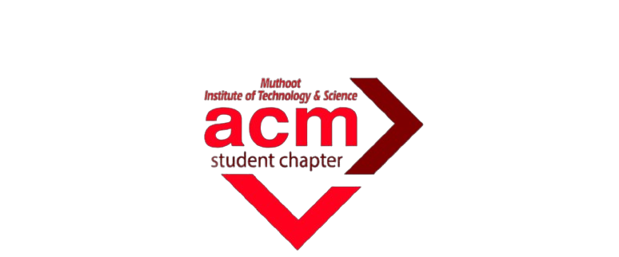
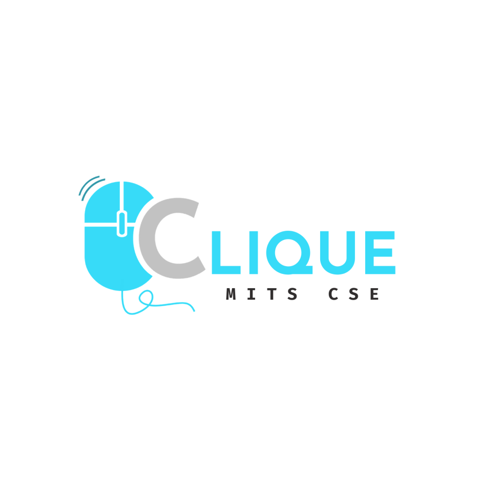

# 🚀 Welcome to NEXUS

### Conducted by | CLIQUE x ACM MITS |

### 📅 March 27 & 28

### 📍 Muthoot Institute of Technology and Science

<p align="center">
  
  
</p>

---

### 📖 Description

A **16-hour hackathon** across various domains where innovation meets execution. Build, collaborate, and push your limits.

---

## 🧠 Project Details (To be filled by participants)

```md
### 🏷️ Project Name:
Minnalize

### 🎯 Chosen Domain:
Cybersecurity and Adaptive Threat Intelligence

### ❗ Problem Statement:
Detecting anomalous behaviour in digital systems

### 💡 Solution:
Minnalize is a malware triage project for Windows executables.
It analyzes .exe and .dll files by checking their PE structure,
inspecting digital signatures, and using image-based AI 
on the binary data to estimate how suspicious the file is.
```
---

## 🎯 Hackathon Domains

Participants must choose **one** of the following domains:

1️⃣ Digital Asset Protection
2️⃣ Smart Supply Chains
3️⃣ Digital Health & Predictive Care
4️⃣ Climate Intelligence
5️⃣ Cybersecurity & Threat Intelligence ✅ 

---

